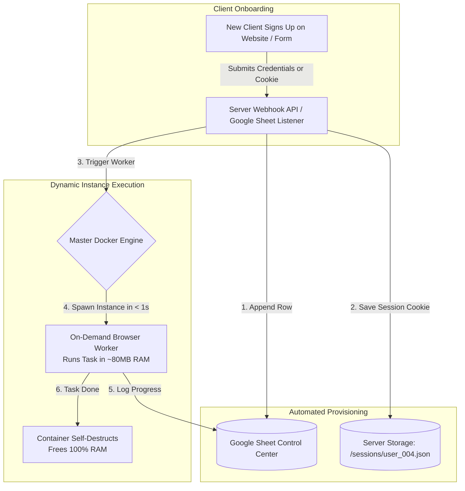
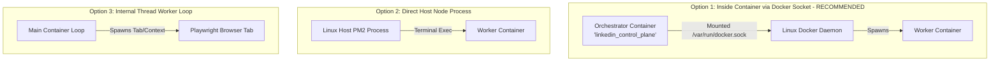

# Automated User Onboarding & Dynamic Instance Orchestration Guide

---

## 1. Overview: How Automated Onboarding Works

When a new client signs up for your SaaS, **no human needs to manually log into the server or create folders**.

An **Automated Orchestrator Engine** handles the entire process on-the-spot:



---

## 2. Where Does the Orchestrator Run?

You have 3 clean options for running your Orchestrator. **Option 1 (Dedicated Control Container)** is the industry recommendation.



### Option 1: Inside a Dedicated Control Container (Recommended ⭐)
* The Orchestrator Webhook API runs **inside its own lightweight Docker container** (`linkedin_control_plane`).
* **How it controls Docker**: Mount the Linux host's Docker socket in `docker-compose.yml`:
  ```yaml
  volumes:
    - /var/run/docker.sock:/var/run/docker.sock
  ```
* **Why this is best**: 100% portable. You don't need to install Node.js or tools on the host Linux OS. Everything is isolated inside Docker!

---

### Option 2: Directly on the Host Linux Server (Simple PM2 Process)
* The Webhook API runs directly on the Linux host machine using Node.js + PM2 (`pm2 start onboard_api.js`).
* When a Webhook arrives, PM2 executes `docker run` directly in the Linux terminal.
* **Why it's good**: Extremely easy to inspect and debug for beginners.

---

### Option 3: Internal Thread inside the Main Engine Container
* If using Google Sheets Polling Listener, the orchestrator script runs inside the main container process as a background thread (`node-cron`).
* When a new active row is detected, it does **not** launch new containers; it simply opens a new Playwright browser tab/context inside its own shared Chromium engine!

---

## 3. Code Setup for Automated Onboarding Webhook (`onboard_api.js`)

You can include this simple API route in your server backend:

```javascript
const express = require('express');
const fs = require('fs');
const { exec } = require('child_process');
const { appendUserToGoogleSheet } = require('./sheets_helper');

const app = express();
app.use(express.json());

// Webhook endpoint called when a new user registers
app.post('/api/onboard-user', async (req, res) => {
  try {
    const { userId, clientName, cookies, targetUrl, messageTemplate } = req.body;

    // 1. Automatically save user session cookies to disk
    const cookiePath = `./sessions/${userId}.json`;
    fs.writeFileSync(cookiePath, JSON.stringify(cookies, null, 2));

    // 2. Automatically append new user row into Google Sheet
    await appendUserToGoogleSheet({
      userId,
      clientName,
      status: 'ACTIVE',
      targetUrl,
      cookiePath,
      messageTemplate
    });

    // 3. Dynamically spawn on-the-spot Docker worker for new user
    const dockerCmd = `docker run --rm -d --name container_${userId} -e USER_ID=${userId} linkedin-engine:latest`;
    exec(dockerCmd, (err, stdout) => {
      if (err) console.error(`Docker launch error: ${err}`);
      console.log(`Successfully spawned dynamic instance for ${userId}`);
    });

    return res.json({ success: true, message: `User ${userId} onboarded and instance triggered!` });
  } catch (error) {
    return res.status(500).json({ success: false, error: error.message });
  }
});

app.listen(3000, () => console.log('Automated Onboarding API running on port 3000'));
```

---

## 4. How Client Cookies Are Captured Automatically

To eliminate manual cookie copying:

1. **Chrome Extension (Recommended)**: Provide a 1-click Chrome extension for your client. The client clicks "Connect LinkedIn", and the extension extracts their `li_at` session cookie and posts it directly to your `/api/onboard-user` Webhook.
2. **Web Onboarding Form**: A secure form where clients paste their cookie token. The form posts to the Webhook, saving the file and triggering the instance automatically.

---

## 5. Summary Checklist for 100% Automated Onboarding

* ✅ **Client Submits Form/Payment** ➡️ Webhook receives user payload.
* ✅ **Server Auto-Saves Cookie File** ➡️ Creates `sessions/user_XXX.json` automatically.
* ✅ **Server Auto-Updates Google Sheet** ➡️ Appends new row with `Status = ACTIVE`.
* ✅ **Docker Auto-Spawns Instance** ➡️ Master engine runs `docker run -e USER_ID=user_XXX`.
* ✅ **Zero Human Intervention** ➡️ Everything happens on-the-spot in < 2 seconds.
