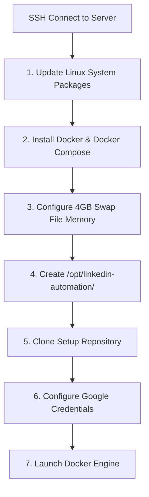

# Server Access & Credentials Setup Guide
## How to Securely Connect the AI Agent to Your Linux Server

---

## 1. Overview: How Remote Server Configuration Works

To allow me (the AI Assistant) to connect directly to your Google Cloud Linux VM, install Docker, setup swap memory, and deploy your multi-tenant SaaS engine automatically, we establish a **secure SSH terminal connection**.

---

## 2. Safe Local Credentials Protocol

To prevent sensitive IP addresses, SSH keys, or passwords from leaking into chat history, credentials are stored in your local `.env` file (`C:\Users\Asad Patel\.env`).

### Required Credentials:

| Variable Name | Description | Example |
| :--- | :--- | :--- |
| `SERVER_IP` | Public IP Address of your GCP Linux VM | `34.120.45.67` |
| `SERVER_USER` | Linux SSH Username | `ubuntu` or `root` |
| `SERVER_SSH_KEY` | Path to your SSH Private Key file | `C:\Users\Asad Patel\.ssh\gcp_key` |

---

## 3. Step-by-Step Instructions to Grant Access

### Option A: Using Google Cloud Web Console SSH Key (Recommended)

1. Open your **Google Cloud Console** ➡️ Go to **Compute Engine ➡️ VM Instances**.
2. Click on your VM instance `linkedin-saas-server`.
3. Under **SSH Keys**, add your SSH public key (`gcp_key.pub`), or use `gcloud` CLI:
   ```bash
   gcloud compute ssh linkedin-saas-server --zone=us-central1-a
   ```

---

### Option B: Safe Local `.env` Registration Command

Run this command in your local PowerShell terminal to safely save your server connection details to `C:\Users\Asad Patel\.env`:

```powershell
printf "Enter SERVER_IP: " && read val && echo "SERVER_IP=$val" >> "$HOME\.env"
printf "Enter SERVER_USER: " && read val && echo "SERVER_USER=$val" >> "$HOME\.env"
printf "Enter SERVER_SSH_KEY_PATH: " && read val && echo "SERVER_SSH_KEY_PATH=$val" >> "$HOME\.env"
```

---

## 4. What I Will Execute Once Access is Granted

Once connected to your server, I will automatically run the following setup steps:



1. **System Upgrade**: Run `sudo apt update && sudo apt upgrade -y`.
2. **Install Docker Engine**: Install Docker CE and Docker Compose V2 system-wide.
3. **Configure Swap Memory**: Create a 4 GB `/swapfile` to prevent Out-Of-Memory crashes.
4. **Deploy Repository**: Clone `https://github.com/xentrox-productions/SAAS-ServerSetup.git`.
5. **Start SaaS Engine**: Execute `docker compose up -d --build` and verify live logs.
