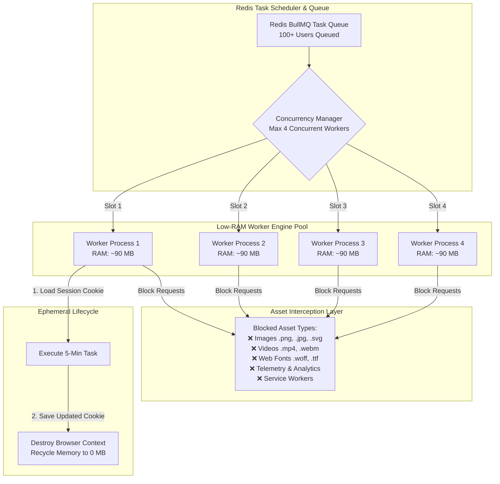

# Server Memory Optimization & Mass-Scaling Playbook
## How to Run 100+ Automation Users on Low-RAM Server Infrastructure

---

## 1. Executive Summary: The Memory Problem & Solution

### The Core Problem
Traditional browser automation setups launch persistent, headful, or unoptimized Chrome instances for each user.
* **1 User Instance** = ~1.5 GB to 2.0 GB RAM
* **10 Users** = ~15 GB to 20 GB RAM (Requires expensive $150+/mo cloud servers)
* **100 Users** = ~150 GB to 200 GB RAM (Unscalable and cost-prohibitive)

### The Optimized Mass-Scaling Goal
By optimizing Chrome launch flags, intercepting heavy network assets, using ephemeral browser worker pools, and queuing tasks via Redis, we reduce RAM consumption by **up to 95%**:
* **1 Active Worker Tab** = ~80 MB to 120 MB RAM
* **4 Concurrent Workers on a 4 GB RAM Server** = < 600 MB Total RAM usage
* **100+ Total SaaS Users** serviced smoothly on a single **$10 - $20/month Google Cloud server**.

---

## 2. Mass-Scaling Architecture Diagram



---

## 3. The 5 Core Pillars of Low-Memory Scaling

### Pillar 1: Chrome Process & Launch Flag Optimization

Standard Chrome launches dozens of background services (GPU process, renderer processes, audio engine, extensions, sync). Using stripped launch flags reduces Chrome's base idle RAM from ~350 MB down to **~45 MB**.

#### Essential Low-Memory Chromium Flags:
```javascript
const browser = await playwright.chromium.launch({
  headless: true,
  args: [
    '--headless=new',                 // Use new fast headless engine
    '--disable-gpu',                  // Disable 3D GPU process (Saves ~100MB RAM)
    '--no-sandbox',                   // Reduce process sandbox overhead
    '--disable-dev-shm-usage',        // Prevent shared memory crashes (/dev/shm)
    '--disable-extensions',           // Disable all Chrome extensions
    '--disable-component-extensions-with-background-pages',
    '--disable-default-apps',         // Block web store apps
    '--disable-background-networking',// Stop background update checks
    '--disable-sync',                 // Stop Google sync services
    '--disable-translate',            // Stop translation engine
    '--metrics-recording-only',       // Stop telemetry logging
    '--no-first-run',                 // Skip first run tasks
    '--safebrowsing-disable-auto-update',
    '--renderer-process-limit=2',     // Limit child renderer processes
    '--js-flags="--max-old-space-size=256"' // Cap V8 JS heap per tab to 256MB
  ]
});
```

---

### Pillar 2: Aggressive Network Resource Interception (Stripping Heavy Payloads)

LinkedIn pages load megabytes of high-resolution images, profile photos, video posts, custom fonts, and tracking scripts. Decoding images and layout trees eats massive RAM. 

By blocking non-essential assets via Playwright/Puppeteer route interception, browser RAM drops from **1.5 GB to ~80 MB**.

#### Network Interception Code Implementation:
```javascript
// Attach to browser context before navigating
await context.route('**/*', (route) => {
  const request = route.request();
  const resourceType = request.resourceType();
  const url = request.url();

  // 1. Block heavy resource types
  if (['image', 'media', 'font', 'stylesheet', 'other'].includes(resourceType)) {
    return route.abort();
  }

  // 2. Block telemetry, analytics & heavy CDN domains
  if (
    url.includes('media.licdn.com') ||        // LinkedIn user photos & media
    url.includes('static.licdn.com/aero') ||   // Non-essential static bundles
    url.includes('google-analytics') ||       // Analytics tracking
    url.includes('doubleclick.net')
  ) {
    return route.abort();
  }

  // Allow only core documents, scripts, and API calls (XHR/Fetch)
  route.continue();
});
```

---

### Pillar 3: Ephemeral Worker Lifecycle (Never Run Browsers 24/7)

#### The Rule: Never keep 100 browser instances running continuously.
Instead of 100 persistent browsers, run **1 single Browser Instance** with **Ephemeral Browser Contexts**.

```
[Task Trigger] ➡️ [Create Incognito Context] ➡️ [Inject Cookies] ➡️ [Run 10 Actions] ➡️ [Save Cookies] ➡️ [Close Context & GC]
```

#### Ephemeral Context Implementation:
```javascript
async function executeUserTask(userId, taskData) {
  // 1. Fetch user's encrypted cookies from DB
  const userSession = await db.getUserSession(userId);

  // 2. Create isolated lightweight context inside shared browser
  const context = await sharedBrowser.newContext({
    storageState: userSession.cookies,
    serviceWorkers: 'block' // Disable heavy background service workers
  });

  const page = await context.newPage();
  
  try {
    // 3. Perform automated task (e.g. send 5 connection requests)
    await page.goto('https://www.linkedin.com/feed/');
    await performOutreach(page, taskData);

    // 4. Save updated session state back to DB
    const updatedState = await context.storageState();
    await db.updateUserSession(userId, updatedState);
  } finally {
    // 5. CRITICAL: Destroy context immediately to flush RAM back to system
    await page.close();
    await context.close();
  }
}
```

---

### Pillar 4: Task Queue Concurrency & Capacity Math

Mass scaling relies on **Task Batching**. Users do not need to perform actions at the exact same millisecond.

#### The Scaling Math:
* Suppose each user task takes **3 minutes** to run.
* **1 Active Worker Slot** can complete **20 user tasks per hour** (480 tasks per day).
* With **4 Concurrent Worker Slots** running on a **4 GB RAM Server**:
  * Total Concurrent RAM used: `4 workers * 100 MB = 400 MB RAM`
  * Daily Capacity: `480 tasks * 4 slots = 1,920 automation runs / day`
  * This allows **100 to 500 active SaaS subscribers** to be serviced on **one cheap server!**

#### Queue Concurrency Configuration (Redis + BullMQ):
```javascript
import { Worker } = from 'bullmq';

// Restrict server to maximum 4 parallel browser tasks
const worker = new Worker('linkedin-tasks', async (job) => {
  await executeUserTask(job.data.userId, job.data);
}, {
  connection: redisConfig,
  concurrency: 4 // Hard cap on simultaneous memory allocation
});
```

---

### Pillar 5: Node.js Memory Leak Prevention & Garbage Collection

When running thousands of queue jobs in Node.js, uncleaned event listeners and string caches accumulate memory over time.

#### Best Practices for Server Stability:
1. **Garbage Collection Exposing**: Start Node.js backend with `--expose-gc`.
2. **Force GC after Batch Tasks**:
   ```javascript
   if (global.gc) {
     global.gc(); // Explicitly clear heap memory after completing batch
   }
   ```
3. **Remove Event Listeners**: Always unregister route handlers (`page.unroute()`) or close pages in `finally` blocks.
4. **Worker Process Recycling**: Restart worker processes automatically after processing 500 jobs (using PM2 or Docker health checks) to flush any hidden memory leaks.

---

## 4. Cheat Sheet: Memory Optimization Comparison

| Optimization Technique | RAM Without Optimization | RAM With Optimization | Memory Reduction |
| :--- | :--- | :--- | :--- |
| **Chrome Launch Flags** (`--disable-gpu`, etc.) | ~350 MB / browser | ~45 MB / browser | **87% Reduction** |
| **Asset Blocking** (Images, Videos, Fonts) | ~1,200 MB / tab | ~80 MB / tab | **93% Reduction** |
| **Ephemeral Context Lifecycle** | ~1,500 MB (Persistent 24/7) | **0 MB (Idle)** / ~100 MB (Active) | **100% Reduction when Idle** |
| **Queue Concurrency (4 Slots)** | 100 Users = 150 GB RAM | 100 Users = **0.4 GB RAM** | **99.7% Reduction** |

---

## 5. Summary Instructions for Implementation

1. **Set Chromium Launch Flags**: Apply bare-minimum flags (`--headless=new`, `--disable-gpu`, `--no-sandbox`).
2. **Enable Route Interception**: Intercept and abort `image`, `media`, `font`, `stylesheet`, and telemetry URLs.
3. **Use Ephemeral Contexts**: Open lightweight browser contexts, run tasks, save cookies, and `close()` context immediately.
4. **Throttle Concurrency via Redis**: Limit parallel jobs to `concurrency: 4` per server node.
5. **Run Scheduled Batching**: Distribute user runs across 24 hours to maximize server density.
