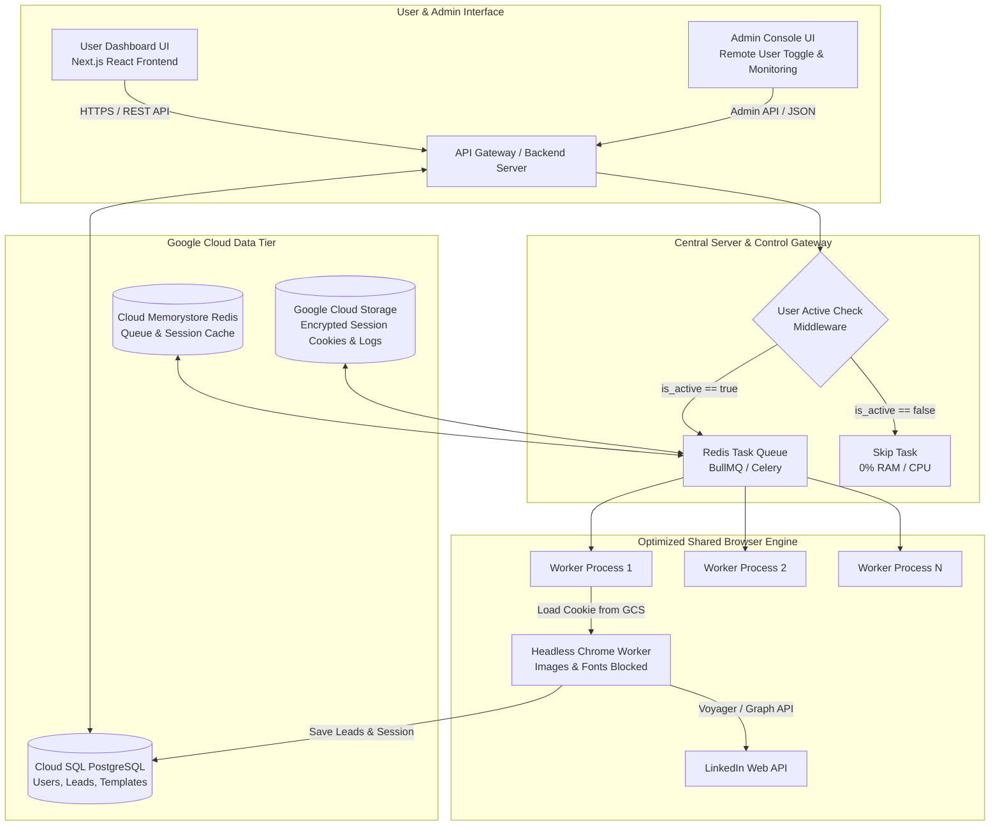
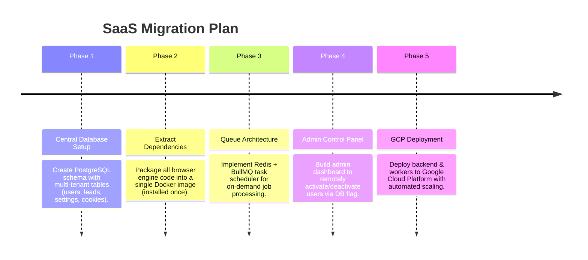

# Multi-Tenant SaaS Architecture & Resource Optimization Blueprint
## Scalable Cloud Architecture for LinkedIn Sales Automation

---

## 1. Executive Summary & Problem Breakdown

### Current Monolithic Setup (Heavy Resource Consumption)
* **Duplicated Footprint**: Each user folder currently duplicates `node_modules`, Chromium browser binaries, Next.js server builds, and static assets (~1 GB to 2 GB per folder).
* **High RAM/CPU Usage**: Running persistent full browser instances (headful mode or unoptimized headless mode) for multiple users causes memory exhaustion (1–2 GB RAM per active browser).
* **Manual Management**: Deactivating or configuring individual users requires modifying local folder files and manually starting/stopping local processes.

### Target SaaS Platform Architecture (Multi-Tenant & Shared Engine)
* **Single Shared Engine**: Dependencies (`node_modules`, Python/Node packages, Playwright binaries) are installed **ONCE** on the server environment (Google Cloud Platform).
* **Multi-Tenant Data Isolation**: Users do not have separate code folders. Instead, each user is represented as an **Account Record** in a central PostgreSQL database with their own encrypted session cookies and settings.
* **Transient Browser Pool & Resource Stripping**: Browsers run in headless mode, strip non-essential assets (images, fonts, videos, telemetry), and execute on-demand via a task queue (Redis + BullMQ). Browser instances are destroyed immediately after completing a job.
* **Central Remote Admin Dashboard**: Admins can activate, pause, or deactivate users remotely with a single toggle switch. Deactivated users take **0% RAM and 0% CPU**.

---

## 2. Master SaaS Architecture Diagram



---

## 3. Key Architecture Pillars

### A. Separation of Code, Engine, and User Data

| Layer | Old Single-User Folder Setup | New SaaS Multi-Tenant Setup |
| :--- | :--- | :--- |
| **Dependencies** | Installed inside every user folder | Installed **ONCE** globally on GCP server / Docker image |
| **User Data** | `.env` and local json files in folder | PostgreSQL database table (`users`, `user_settings`) |
| **LinkedIn Cookies** | Stored in local folder profile | Encrypted JSON in database or Google Cloud Storage |
| **Execution** | Continuous local loop per user | Scheduled jobs queued in Redis (BullMQ) |
| **RAM per User** | 1.5 GB - 2.0 GB continuously | **0 MB idle**, ~100 MB only during active task |

---

### B. Remote Admin Activation & Deactivation System

To remotely activate/deactivate users from your backend admin dashboard:

1. **Database Schema Field**:
   Add `status` and `is_active` fields to your central `users` table:
   ```sql
   ALTER TABLE users ADD COLUMN is_active BOOLEAN DEFAULT TRUE;
   ALTER TABLE users ADD COLUMN status VARCHAR(20) DEFAULT 'ACTIVE'; -- ACTIVE, PAUSED, DEACTIVATED
   ```

2. **Admin API Endpoint**:
   ```javascript
   // POST /api/admin/users/:userId/toggle-status
   app.post('/api/admin/users/:userId/toggle-status', async (req, res) => {
     const { userId } = req.params;
     const { isActive } = req.body;
     
     await db.query('UPDATE users SET is_active = $1 WHERE id = $2', [isActive, userId]);
     await redis.set(`user_active:${userId}`, isActive ? '1' : '0'); // Cache for fast queue checks
     
     return res.json({ success: true, userId, isActive });
   });
   ```

3. **Queue Worker Middleware**:
   Before executing any LinkedIn outreach job:
   ```javascript
   async function processUserJob(job) {
     const { userId } = job.data;
     const isActive = await redis.get(`user_active:${userId}`);
     
     if (isActive === '0') {
       console.log(`User ${userId} is DEACTIVATED. Aborting job.`);
       return; // Job exits immediately without launching a browser
     }
     
     // Proceed to execute optimized browser task...
   }
   ```

---

### C. Resource Optimization Strategies (Slashing RAM from 2 GB to ~100 MB)

#### 1. Headless Resource-Stripped Browser Cluster
Instead of rendering full LinkedIn web pages with images, videos, and ads:
* **Run Modern Headless Chrome**: Use `--headless=new`, `--disable-gpu`, `--no-sandbox`, `--disable-dev-shm-usage`.
* **Block Heavy Network Assets**: Intercept network requests and abort non-essential resources:
  * Block images (`.png`, `.jpg`, `.svg`, `media.licdn.com`)
  * Block media/video streams
  * Block custom web fonts (`.woff`, `.woff2`)
  * Block analytics/telemetry scripts (`static.licdn.com/aero*`, Google Analytics)
* **Effect**: Keeps RAM usage per active tab around **80 MB - 150 MB** (down from 1.5 GB).

#### 2. Shared Worker Queue (On-Demand Browser Tab Spawning)
Instead of keeping 100 browser instances open for 100 users 24/7:
* **Batch Scheduling**: Schedule users to run in worker slots (e.g., User 1 runs at 9:00 AM, User 2 runs at 9:15 AM).
* **Tab Spawning & Cleanup**:
  1. Worker fetches job for User X.
  2. Worker opens 1 headless browser context.
  3. Worker injects User X's saved LinkedIn cookies.
  4. Worker completes 10 outreach messages / scrapes.
  5. Worker saves updated cookies to Database / Cloud Storage.
  6. Worker closes browser context and releases memory immediately.

---

## 4. Google Cloud Platform (GCP) Infrastructure Setup

| GCP Component | Role & Purpose | Estimated Cost Tier |
| :--- | :--- | :--- |
| **GCP Cloud Run** (or Compute Engine E2-Standard) | Runs the Next.js API Gateway, Admin Backend, and Dockerized Worker Engine. | Pay-per-use / Low fixed cost |
| **Cloud SQL for PostgreSQL** | Central multi-tenant database for user accounts, leads, templates, and execution logs. | Shared small DB instance |
| **Cloud Memorystore (Redis)** | High-speed task queue engine (BullMQ) and active-user cache. | Standard small Redis instance |
| **Google Cloud Storage (GCS)** | Secure bucket for encrypted user session cookie files and exported CSV reports. | Pennies / GB |

---

## 5. Step-by-Step Implementation Roadmap



---

## 6. Summary Checklist for Maximum Simplicity

1. **Do not create separate folders per user.** Keep 1 master codebase.
2. **Represent users as rows in a database table.**
3. **Store LinkedIn logins/cookies in Cloud Storage or DB (encrypted).**
4. **Use Redis queue to run 2–5 headless workers shared across all users.**
5. **Enforce remote user activation via `is_active` database checks.**
6. **Block images, fonts, and stylesheets in Playwright/Puppeteer to keep memory under 150 MB per worker.**
