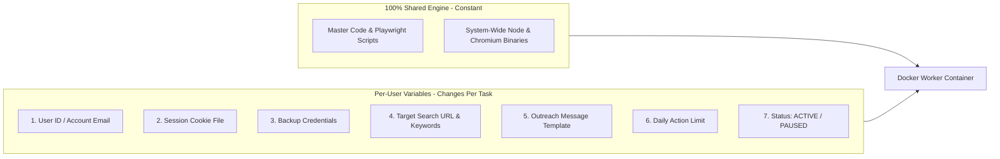

# Server Infrastructure: Multi-Tenant SaaS Blueprint

---

## 1. Executive Summary

Yes, exactly! By leveraging **ONE master Docker image** with system-wide dependencies installed once globally, you can build a complete, highly-scalable SaaS platform for LinkedIn automation without duplicating code, folders, or libraries.

---

## 2. Core Infrastructure Pillars

### A. One Single Master Docker Image (Installed Once)
* All heavy components—Linux OS, Node.js, Playwright, Chromium (`~350 MB`), and npm dependencies—are built **ONCE** into a single master Docker base image (`~800 MB`).
* You **never** duplicate code, folders, or `node_modules` per user.

### B. Unlimited Users at Zero Extra Disk Cost
* Each new client/user onboarded is represented as **1 row in your Google Sheet** plus **1 tiny session cookie JSON file (`~4 KB`)**.
* Adding 100 users requires virtually **0 MB of extra disk space**.

### C. Mass-Scaling on a Cheap Cloud Server
* Whenever an active user's scheduled turn comes, Docker boots a worker context from the single master image, strips images/fonts to run in **~80 MB RAM**, writes outreach results directly back to your Google Sheet, and self-destructs (`--rm`).
* You can run a full multi-tenant SaaS platform supporting **100+ active client accounts** on a single **$10 to $15/month Linux Cloud VPS** (Google Cloud Compute Engine / Hetzner / DigitalOcean).

### D. 1-Click Remote Admin Control Switch
* Activating or deactivating a client is as simple as changing Column C in your Google Sheet from `ACTIVE` to `PAUSED`. 
* The server checks the sheet before starting any run. If set to `PAUSED`, it skips the user instantly (**0% RAM / 0% CPU spent**).

---

## 3. Per-User Variables Breakdown (What Changes Per Container)

The automation code, Playwright scripts, and dependencies are 100% constant across all containers. 

**The ONLY things that change per container are the User-Specific Variables:**



### Complete List of Per-User Variables:

| Variable Type | Variable Name | Purpose / Function |
| :--- | :--- | :--- |
| **Authentication** | `Session Cookie File` (`user_001.json`) | Allows 99% of runs to open LinkedIn instantly without password login |
| **Authentication** | `Email & Password` | Backup credentials in case cookies expire and auto-re-login is needed |
| **Targeting** | `Target Search URL` | The specific LinkedIn search query URL for this user's campaign |
| **Campaign** | `Message Template` | Custom outreach text with variables like `{First_Name}`, `{Company}` |
| **Throttling** | `Daily Action Limit` | Max connection requests allowed per day (e.g. 15/day) |
| **Remote Control** | `Status` | `ACTIVE` (Run task) or `PAUSED` (Skip task instantly) |

---

## 4. How Software Updates Work (Zero-Downtime Rollouts)

When you release a new version of your software (bug fixes, new features, UI improvements):

**YES! You simply rebuild/replace the Docker image.**

```bash
git pull origin main                   # 1. Pull updated code
docker-compose up -d --build           # 2. Rebuild and restart instantly
```

### Why Updates Are 100% Safe:
* **Zero User Data Loss**: User session cookies and Google Sheet connections live outside the container.
* **Instant Upgrade**: Docker stops the old container and boots the new image version in **< 3 seconds**.
* **Zero User Re-Logins**: Clients stay logged in without needing to touch anything.

---

## 5. Workspace Documentation Directory

The complete technical blueprints for this infrastructure are available in your workspace:

1. 📄 [SAAS_PLATFORM_ARCHITECTURE.md](file:///d:/Google%20Drive/AI%20Automation/Sand-Box/Lead%20Qualitifer%20&%20Google%20Sheet%20Cleaner/Projects%20-%20One%20Time/Linkedin-Sales-Automation-Server-Plans/SAAS_PLATFORM_ARCHITECTURE.md)
2. 📄 [MEMORY_OPTIMIZATION_AND_MASS_SCALING.md](file:///d:/Google%20Drive/AI%20Automation/Sand-Box/Lead%20Qualitifer%20&%20Google%20Sheet%20Cleaner/Projects%20-%20One%20Time/Linkedin-Sales-Automation-Server-Plans/MEMORY_OPTIMIZATION_AND_MASS_SCALING.md)
3. 📄 [GOOGLE_SHEET_DOCKER_DEPLOYMENT_PLAN.md](file:///d:/Google%20Drive/AI%20Automation/Sand-Box/Lead%20Qualitifer%20&%20Google%20Sheet%20Cleaner/Projects%20-%20One%20Time/Linkedin-Sales-Automation-Server-Plans/GOOGLE_SHEET_DOCKER_DEPLOYMENT_PLAN.md)
4. 📄 [DOCKER_USER_MANAGEMENT_AND_SHARED_DEPENDENCIES.md](file:///d:/Google%20Drive/AI%20Automation/Sand-Box/Lead%20Qualitifer%20&%20Google%20Sheet%20Cleaner/Projects%20-%20One%20Time/Linkedin-Sales-Automation-Server-Plans/DOCKER_USER_MANAGEMENT_AND_SHARED_DEPENDENCIES.md)
